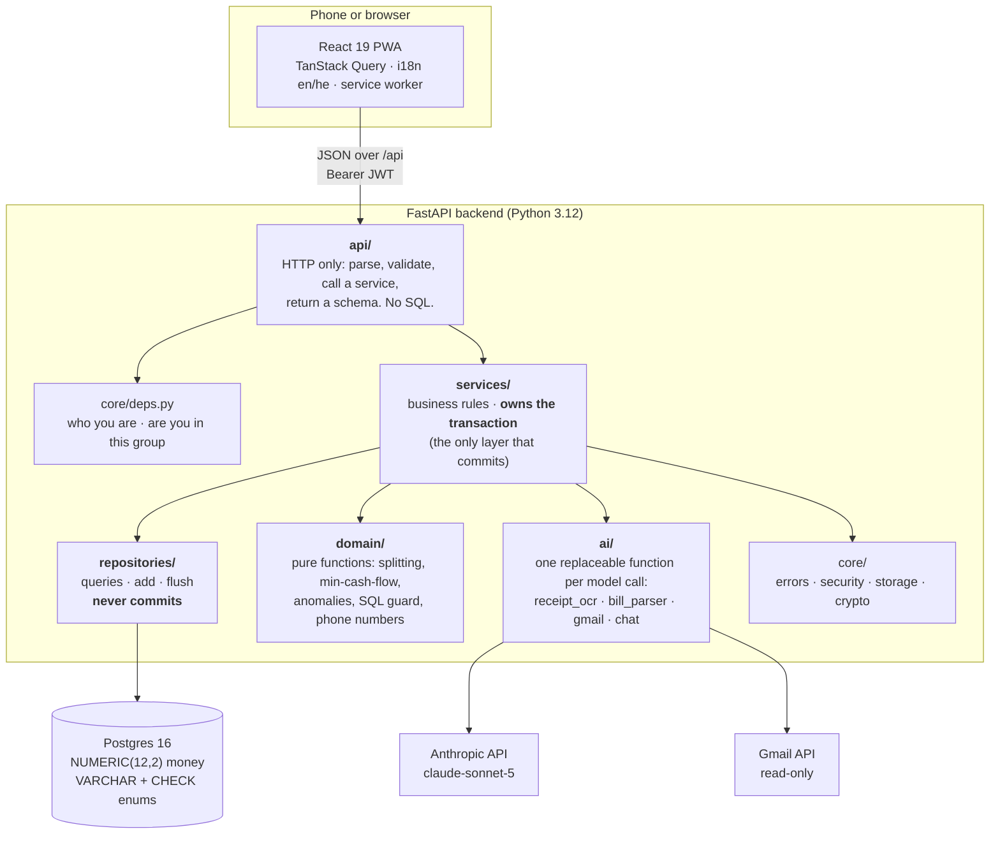
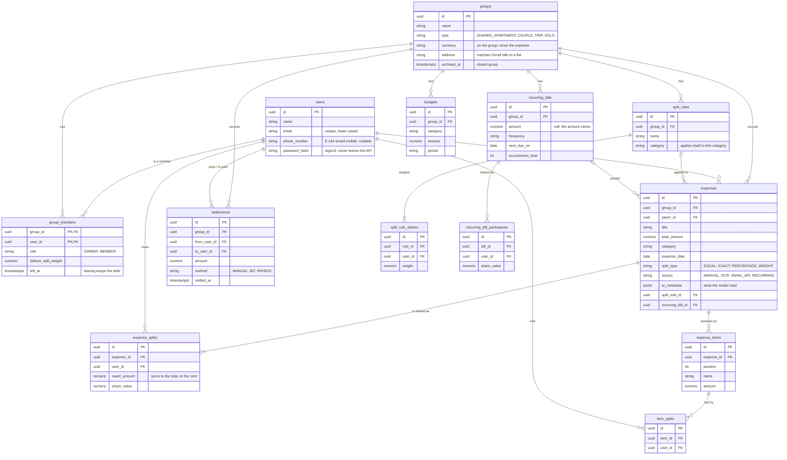
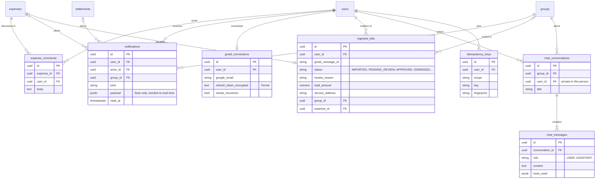
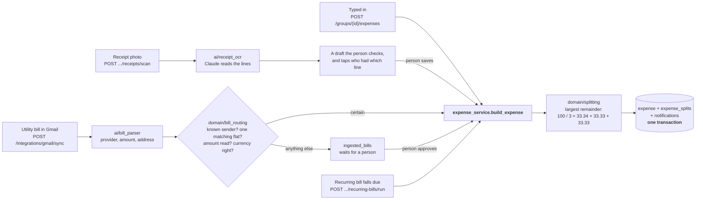
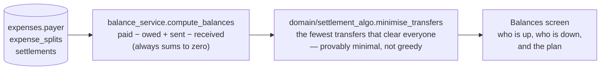
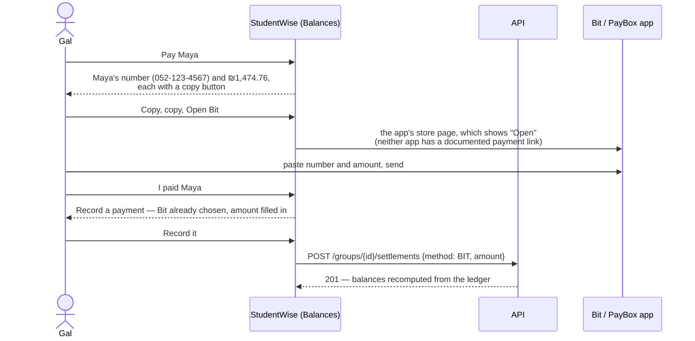
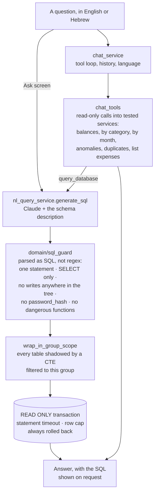

# StudentWise — Architecture

Diagrams for mission 11.2: the layers, the database, and the paths money and AI
take through them. They render on GitHub (Mermaid). Every name in them is a real
module or table; when one stops being true, fix the diagram in the same commit.

The database diagrams were generated from the SQLAlchemy models on 2026-10-06
(20 tables, main at `bcc649c` plus 7.1–7.3). Two tables are on their way in on
branches not yet merged: `receipt_images` (deployment, 10.3: receipt photos in
Postgres, because a free host's disk does not survive a restart) and
`expense_embeddings` (semantic search, 8.3). Add them when they land.

- [1. The layers](#1-the-layers)
- [2. The database](#2-the-database)
- [3. Four ways into the ledger](#3-four-ways-into-the-ledger)
- [4. From the ledger to settling up](#4-from-the-ledger-to-settling-up)
- [5. How the AI reads the data, safely](#5-how-the-ai-reads-the-data-safely)

---

## 1. The layers

Four backend layers and nothing more. Each arrow is an import, and nothing
imports upward.

**Why it is shaped like this.**

- **Only services commit.** A repository that committed could leave an expense
  saved with no splits. A service builds everything — the expense, its splits,
  the notifications about it — and commits once, so it all lands or none of it
  does.
- **`domain/` takes numbers and returns numbers.** Splitting, the settlement
  plan, anomaly scores and the SQL guard have no database and no web framework
  in them, so they are tested exhaustively and fast (`pytest tests/unit`).
- **Every model call is one function in `ai/`**, which the tests replace. No
  test needs an API key or a network, and swapping a model is a setting.
- **The frontend never does money arithmetic.** It formats what the API sends;
  the API allocates cents. Two implementations would disagree by a cent.

---

## 2. The database

Twenty tables. Ids are UUIDs, money is `NUMERIC(12,2)`, and every enum is a
`VARCHAR` with a `CHECK` rather than a Postgres `ENUM`, so adding a value is not
a migration headache. Deleting is real: removing an expense cascades to its
splits, items, comments and notifications.

### The ledger

What balances are computed from, and what produces it.

`expense_splits` is the single source of truth for who owes what. Items, split
rules and recurring bills all **produce** ordinary splits; balances and
analytics never learn that items exist.

### Around the ledger

Conversation, alerts, ingestion and safety. None of it is money.

- **A bill from Gmail is not an expense until it is decided.** It waits in
  `ingested_bills`; there is deliberately no status column on `expenses`, which
  seventeen modules read as money.
- **Notification wording is never stored** — a `kind` and a payload of facts —
  so the app is shown in Hebrew without a migration.
- **Idempotency keys** make a retried `POST` on a bad connection return the
  first result instead of creating a second expense.

---

## 3. Four ways into the ledger

However an expense arrives, it goes through `expense_service.build_expense`, so
splitting, notifications and the budget check are written once.

**Nothing a model read touches money until it is decided.** A scanned receipt
is a draft the person corrects. A Gmail bill is split without a person only when
everything checks out; otherwise it waits with the reason, because anyone can
email a convincing "לתשלום". Nothing runs on a scheduler: opening the app posts
due bills and syncs Gmail once per session, and `run_due_bills.py` /
`fetch_new_bills.py` exist for a real cron.

---

## 4. From the ledger to settling up

Balances are never stored. They are computed from the ledger on every read, so
they cannot drift from it.

Paying a transfer from the plan (7.1–7.3):

Only the person can say the money left, so nothing moves a balance until it is
recorded. Maya's number is visible only to people who share a group with her;
user search never returns phone numbers.

---

## 5. How the AI reads the data, safely

Ask (9.9) and the chat assistant (8.1–8.2) let a model write SQL and call
tools. The model is treated as **an input, not a trusted component**: it has
read expense titles and names that anyone in the group could have typed.

Any one of these layers failing still leaves the data safe: a query that slipped
the guard still sees one group, in a transaction that cannot write. Text from the
data — titles, notes, names — is wrapped and labelled as data, never
instructions, in every prompt. How often the answers are actually right is
measured against the real model in [`docs/evals/`](evals/).
